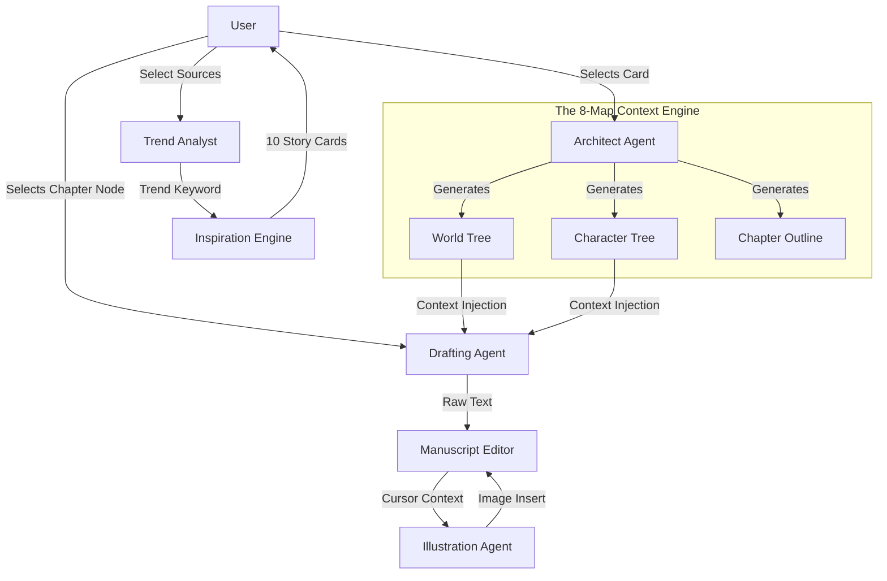

# InkFlow Studio: Collaboration Design Document

## 1. Overview
The **Studio (Writing Studio)** is the core operational hub of InkFlow AI. Unlike standard chat interfaces, the Studio is designed as a **Context-Aware Co-Pilot**. It assumes the user is the creative director while the AI acts as the execution engine (Architect, Drafter, and Editor).

The core philosophy is **"Structure First, Content Second"**. The AI does not just generate text; it generates structured metadata (The 8-Map System) which then informs the text generation.

## 2. Core Modules & AI Agents

The Studio is composed of four distinct AI agents that interact via the `GeminiService`:

### A. The Trend Analyst (Data Injection)
*   **Input**: Aggregated data from Dashboard (Social media trends, Ranking lists).
*   **Action**: Synthesizes a `TrendFocus` keyword (e.g., "Cyberpunk Immortal Cultivation").
*   **Output**: A high-level direction injected into the Inspiration Engine.

### B. The Inspiration Engine (Daily Gen)
*   **Model**: Gemini 2.5 Flash (Optimized for speed/creativity).
*   **Function**: `generateDailyStories`
*   **Mechanism**: 
    1.  Receives `TrendFocus`.
    2.  Generates 10 structured cards.
    3.  Each card contains specific "Web Novel Metas" like *Golden Finger* (Cheat), *System* (Power mechanics), and *Memory Anchor* (Iconic items).
*   **Linkage**: The output metadata is **not** just text; it is a structured object passed to the Architect module.

### C. The Architect (The 8-Map System)
*   **Model**: Gemini 3 Pro (Optimized for complex logic/structure).
*   **Function**: `generateNovelArchitecture`
*   **Concept**: Instead of a flat outline, the AI generates a JSON tree containing 8 branches:
    1.  **World**: Geography & Laws.
    2.  **System**: Power hierarchy & Upgrades.
    3.  **Mission**: Quests.
    4.  **Character**: Relationships & Stats.
    5.  **Anchor**: Key items.
    6.  **Structure**: Volumes/Acts.
    7.  **Events**: Plot points.
    8.  **Chapters**: Execution sequence.
*   **Retrieval Mechanism**: These trees act as a database. When writing Chapter 5, the system looks up "World" and "Character" nodes to provide context.

### D. The Drafter (Content Generation)
*   **Model**: Gemini 2.5 Flash / 3 Pro.
*   **Function**: `generateChapterContent`
*   **Linkage**: 
    *   **Input**: A specific `OutlineNode` (Chapter).
    *   **Context**: The system recursively traverses the `World` and `Character` trees to build a `Global Context String`.
    *   **Prompt**: `Write {Node.Description} given {Global Context}`.
    *   **Benefit**: Ensures the character names and world rules remain consistent without hallucinations.

## 3. Detailed AI Linkage Flow

The following diagram illustrates how data flows between the user and the AI agents within the Studio.



## 4. Interaction Design

### View Modes
The Studio switches between 4 specific views to accommodate different stages of the writing process:

1.  **Quick Tools**: A scratchpad for rapid `Rewrite`, `Polish`, or `Continue` operations on loose text.
2.  **Story Map**: A D3.js powered visualization of the 8-Map Architecture. Users can click nodes to edit meta-data or trigger generation.
3.  **Manuscript (Files)**: A file-system view of generated chapters.
4.  **Editor**: A full-screen writing environment.

### The "Bridge" Button
In the Editor, the **"AI Modify"** toolbar acts as a bridge. 
*   It takes the current text in the textarea.
*   It fetches the *latest* state of the `World` and `Character` maps.
*   It sends both to the AI for rewriting.
*   **Result**: If the user changed a character's name in the Map, the "Rewrite" function will update the text to reflect that change automatically because of the injected context.

## 5. Data Structure

The linkage relies on the `StudioRecord` type:

```typescript
interface StudioRecord {
    // ...
    architecture: {
        world: OutlineNode;       // Context Source A
        character: OutlineNode;   // Context Source B
        chapters: OutlineNode;    // Execution Queue
        // ... other maps
    };
    chapters: Array<{
        title: string;
        content: string;
        nodeId: string;           // Link back to Architecture
    }>;
}
```

This `nodeId` linkage allows the system to update the Mind Map status when the text content changes, keeping the "Blueprint" and the "Building" in sync.